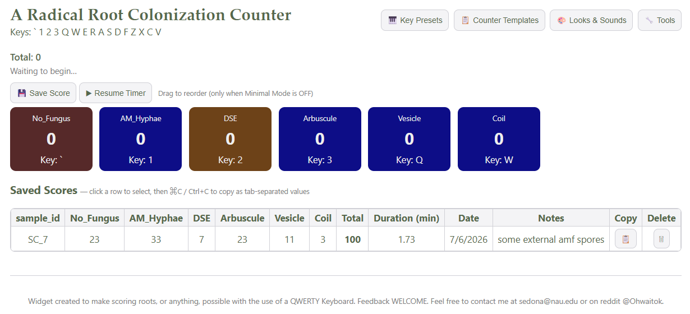
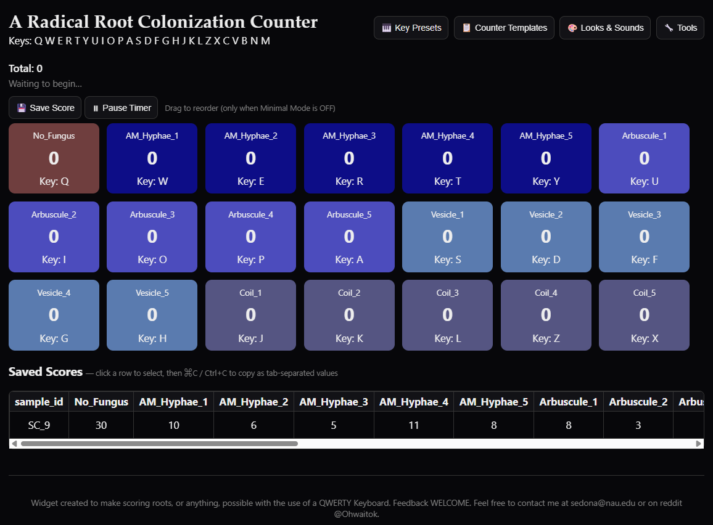

# Summary

Quantifying fungal root colonization is a foundational task in plant-soil ecology. 
Current methods rely commonly on physical hand counters necessitating post hoc manual data transcription, 
which is inherently inefficient and introduces potential error. 

The Radical Root Colonization Counter, a lightweight web application, was designed 
to streamline grid intersect root scoring. This tool enables rapid counting 
using personalized keyboard key combinations, audio feedback for quality control, 
customizable counter categories, and automated session data recording. 
Each sample count is stored locally and can append, or be exported as, a csv file 
ready for statistical analyses. 

By removing manual transcription, adding immediate audio confirmation of structures recorded, 
and streamlining data input as well as output, this application improves the efficiency 
and data integrity of human-counted root colonization workflows. 
The design process of this tool also demonstrates the utility of iterative, user-driven development 
supported by AI-assisted prototyping in the creation of specialized tools used for improving scientific methods.

# Statement of need

Quantification of root colonization is an informative and often cost effective metric in studies of plant-microbe interactions and soil ecosystem function [@Brundrett:2009]. ‘Grid intersect scoring methods’ such as [@Trouvelot:1986] and [@McGonigle:1990] methods are based on visual assessment of a representative subsample of root segments under compound microscope and classification of observed fungal root-colonizers that vary by experiment (e.g., Arbuscular Mycorrhizal Fungal (AMF)  Structures, dark septate endophytes, non-am hyphae, plasmodiophorids, olpidium structures). Counting is often done on hand counters followed by transcription of those counts onto a paper worksheet or directly into a digital spreadsheet.

Grid intersect methods have several limitations. First, each button on a hand counter corresponds to a structure, counter buttons are often being relabeled in a shared lab based on personal preference and an experiment's ‘structures-present’ specificity. This can add time to set up when button locations must be relabeled between scoring sessions. Second, transcription of counts from physical into digital datasets is time-consuming and introduces opportunities for scribal error. Third, all buttons produce the same “click” sound, which can increase error at speed because the sound confirms a button press, but not necessarily the correct button. Both new and old hand counters are also known to erroneously ‘click’ yet not add to a count, therefore best practice necessitates looking up from a slide to make sure the counter has counted, adding unnecessary mental load and seconds to every intersection (a single root count). Seconds will become minutes when the user has 100 - 200 root intersections to count.

To address these shortcomings, the Radical Root Colonization Counter was developed, a browser-based web application designed to facilitate rapid and specialized scoring techniques enabling the generation of data ready for statistical analyses without transcription. The tool also emphasizes minimal technical interaction, real-time audio and visual feedback, and instant generation of structured datasets.

# State of the field   

Innovative tools, such as AMFinder [@Evangelisti:2021], can “score” (all counts of total structures for one sample or slide) root images digitally, and with more accuracy than grid intersect methods; but this technique requires the user scan or photograph each slide and have the technical proficiency to utilize the software. Therefore the decision is often made to use the common, human-scored, grid intersect methods. There is an inspiring abundance of research into the computational automation of human-scoring, yet an absence of simple, customizable digital tools tailored to the widely used human-scoring workflow.

# Software design

The primary design goals were to facilitate highly specialized scoring needs with customizable button options, maintain visual focus on the microscope slide by minimizing user interaction during scoring, create audible confirmation of specific button presses, and provide structured data output. Many of the features included were borne of suggestions from lab mates testing the and retesting the prototype.

The Counter is implemented as a single web page using standard languages (HTML, CSS, and JavaScript). It runs entirely within a web browser and all data is stored locally avoiding any installations, server infrastructures, or internet connectivity. Additionally, all components are platform-native browser APIs making this a zero-dependency web tool.

Each counter is mapped to fixed keyboard keys of the user’s choosing, with some presets (eg., Q-M, F1-3), enabling rapid input without mouse interaction. This allows users to memorize personally optimal key locations to maintain continuous visual focus on the roots while scoring.

Each ‘count’ triggers a spoken numeric value of the amount the category has reached followed by the name of the category the button is tied to using the specific browser’s speech synthesis functionality. This provides immediate confirmation of input without requiring visual verification. Root colonization is often done on 100-150 ‘intersections’ therefore a song is played when the user reaches 100 and 150 intersections.

Users can edit counter names and colors to match specific scoring schemes. This is possible when toggled out of ‘minimal mode’. The application includes two interface modes contained in the ‘Looks & Sounds’ menu. Full mode allows editing of counter names, colors, and order. Minimal mode presents large, simplified counters optimal for rapid scoring \autoref{fig:1}.

The buttons can be easily renamed, moved, and recolored depending on experimental needs. If a user would like to score using the more accurate (Kokkoris 2019) but more time consuming Trouvelot (1986) method wherein colonization intensity is captured using a ranking system of 1-5 for specified fungal structures; the categories could be as follows in \autoref{fig:2}.

{ width=20% }

Each slide is treated as a discrete “score.” The application automatically records the start timestamp (first count), end timestamp (when saved), and total duration of the two. This enables time tracking for each score to help the user control time spent on each slide (WHATWG 2026. HTML Living Standard).

Counter configurations and score histories are stored locally in the browser so it was logical to integrate an exporting function. Scores can be exported as a pivoted CSV file and Counter Configurations can be saved as json files making them portable and shareable across systems via simple file transfers. Scores can also be appended to a chosen dataset, minimizing the risk of accidental overwriting. Historical scores retain their original counter names, even if counter configurations are later modified. A sample is only named after scoring, this encourages ‘blind scoring’ to prevent unconscious confirmation bias [Kardish:2015]. ‘Blind scoring’ is accomplished by preventing the microscopist from seeing the sample’s treatment labels until after scoring is complete, then the sample name can be revealed and recorded. When ‘save score’ is pressed two pop-up’s ask in succession what to name a sample and if there are notes for the sample, encouraging the user to record anything novel.

# Research impact statement

The `Radical Root Colonization Counter` was developed as a tool to assist the colonization of one project but has grown to be tested and used and by many others in the soil lab. It provides a simple, accessible solution for rapid and standardized root colonization scoring. By integrating keyboard-based input, real-time feedback, and structured data export, the counter reduces cognitive load, minimizes error, and improves efficiency. This application demonstrates the potential of developing lightweight digital tools to enhance data collection in ecological research. The keyboard-driven interface reduces hand movement and minimizes interaction. Audio feedback further reduces the need for visual confirmation, supporting efficient scoring. By eliminating manual transcription and enabling real-time data capture, the application reduces total processing time from observation to analysis-ready dataset. Direct digital recording of counts reduces transcription errors and standardizes data structure across scores.

# AI usage disclosure

LLM-assisted code generation with Claude, ChatGPT and Gemini was used to accelerate implementation, without requiring formal HTML software training. The application was developed using an iterative, user-driven design process focused on usability during microscopy. Development proceeded through prototyping cycles, with features added and refined based on testing of the tool while scoring. LLM-assisted code generation with Claude, ChatGPT and Gemini was used to accelerate implementation, without requiring formal HTML software training. However, domain expertise was essential for defining requirements, validating functionality, and ensuring feature relevance for practical scoring [Peng:2023].

# Availability and usage

The `Radical Root Colonization Counter` is freely available as a browser-based
web application:
- <https://sedonams.github.io/AMF-Colonization-Counter/>
Source code is available at:
- <https://github.com/Sedonams/AMF-Colonization-Counter>
The software can also be downloaded and distributed as a standalone HTML file.

# Acknowledgements

Financial support was provided by the US Department of Energy program in Systems Biology Research to Advance Sustainable Bioenergy Crop Development grant DE-SC0021386 (DE-FOA-0002214). Thanks to Dr. Beatice Bock for literary encouragement, Callum Rohrer for constructive and feedback during beta testing, Dr. Nancy Collins Johnson for advising, and all the NAU Soil Ecology Lab technicians who continue to provide refinement suggestions.

# References
